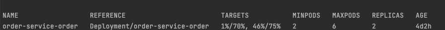
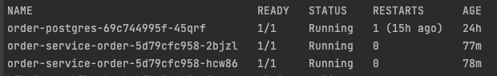
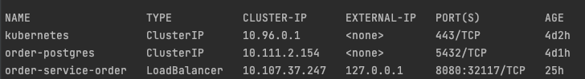
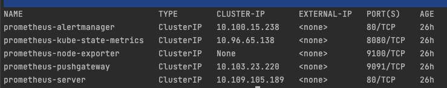
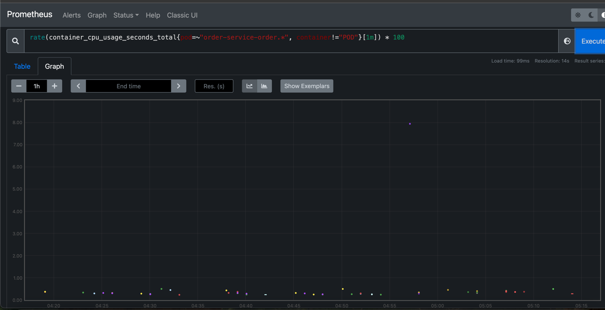
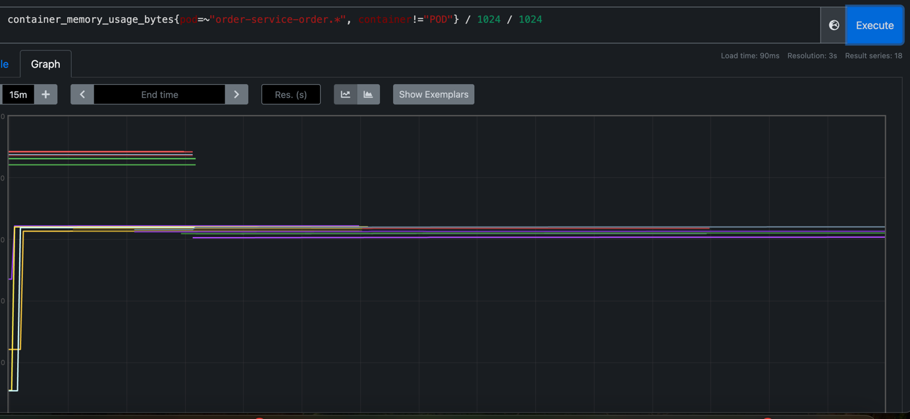
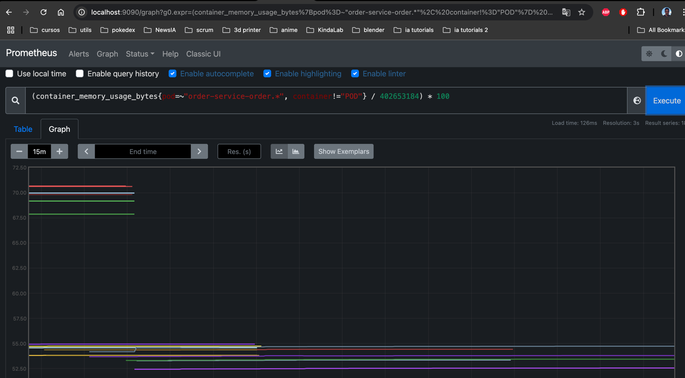

# Order Service Helm Chart

Este Helm Chart despliega el microservicio `order-service` en un clúster de Kubernetes. Incluye soporte para escalado automático (Horizontal Pod Autoscaler).

---

## 📦 Estructura

- `Chart.yaml`: metadatos del chart
- `values.yaml`: parámetros configurables
- `templates/`:
  - `deployment.yaml`: definición del Deployment
  - `service.yaml`: definición del Service
  - `hpa.yaml`: definición del autoscaler (HPA)
  - `_helpers.tpl`: templates auxiliares

---

## 🚀 Cómo usar

### 1. Instalar el chart

```bash
helm upgrade --install order ./order-service
```

### 2. Variables configurables

Editá `values.yaml` o pasá `--set` en línea:

```yaml
replicaCount: 2

image:
  repository: your-dockerhub-username/order-service
  tag: latest

service:
  type: ClusterIP
  port: 8080

autoscaling:
  enabled: true
  minReplicas: 2
  maxReplicas: 6
  targetCPUUtilizationPercentage: 70
```

---

## 📈 Requisitos

- Kubernetes 1.23+
- Helm 3.x
- `metrics-server` instalado:

```bash
kubectl apply -f https://github.com/kubernetes-sigs/metrics-server/releases/latest/download/components.yaml
```

---

## ✅ Verificar el despliegue

```bash
kubectl get hpa
```

```bash
kubectl get pods
```


```bash
kubectl get svc
```


```bash
kubectl get svc -n monitoring 
```


---

## 📊 Cómo ver las métricas en Prometheus
Si tenés Prometheus instalado en tu clúster (por ejemplo, con prometheus-community/prometheus), podés consultar fácilmente las métricas de CPU y memoria de los pods order-service.

Installar prometheus
```bash
helm install prometheus prometheus-community/prometheus \                                                                              
--namespace monitoring --create-namespace \
-f custom-values.yaml \                                                                    
--disable-openapi-validation
```

🔍 Métricas útiles en Prometheus
➤ Uso de CPU por pod (%)
```promql
rate(container_cpu_usage_seconds_total{pod=~"order-service-order.*", container!="POD"}[1m]) * 100
```

➤ Uso de memoria por pod (MiB)
```promql
container_memory_usage_bytes{pod=~"order-service-order.*", container!="POD"} / 1024 / 1024
```


➤ Uso de memoria como % del request (si requests.memory = 384Mi)
```promql
(container_memory_usage_bytes{pod=~"order-service-order.*", container!="POD"} / 402653184) * 100
```


🔧 Acceder a Prometheus
Si usás Minikube o el LoadBalancer no tiene IP, podés hacer port-forward:

kubectl port-forward svc/prometheus-server -n monitoring 9090:80


## 🧑‍💻 Autor

Ignacio Maylin — Proyecto portafolio SR Java — 2025
