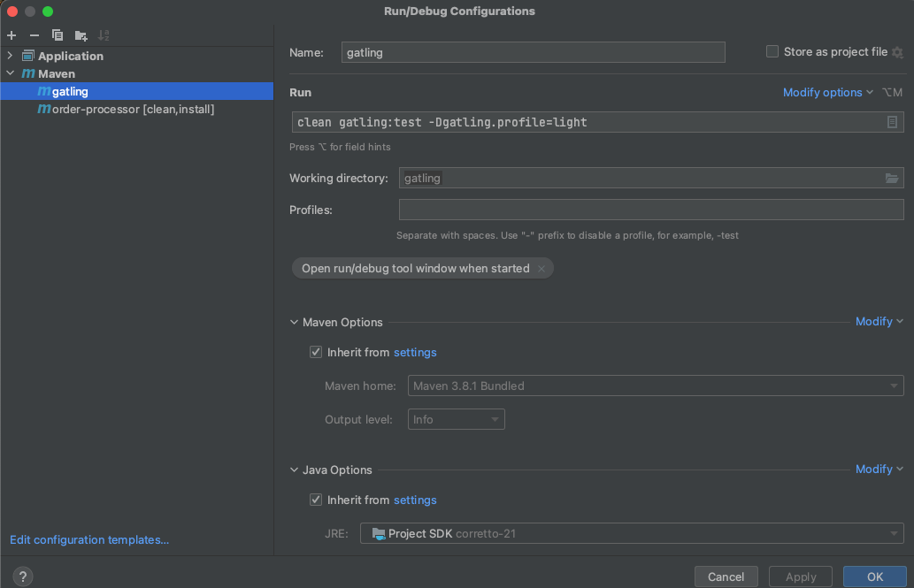
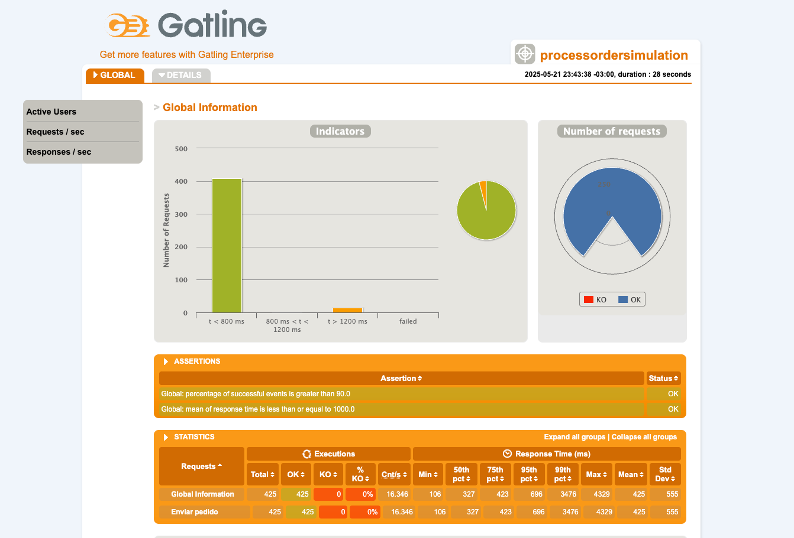
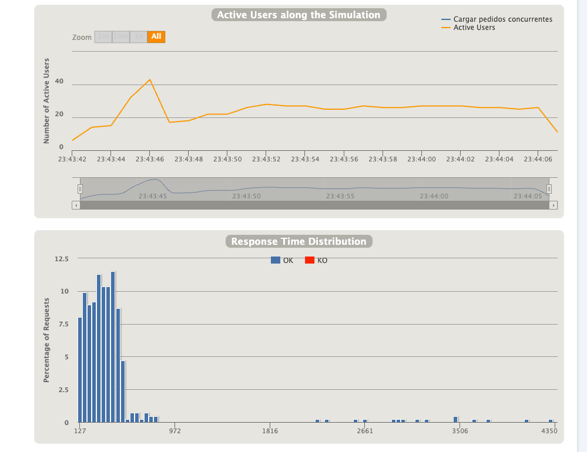
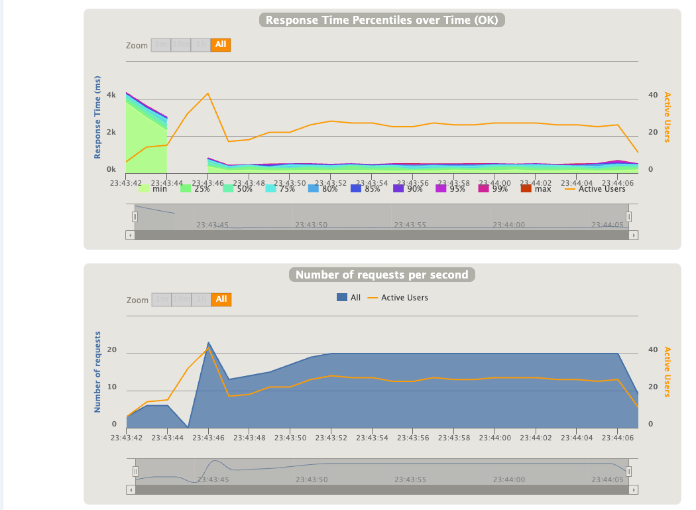
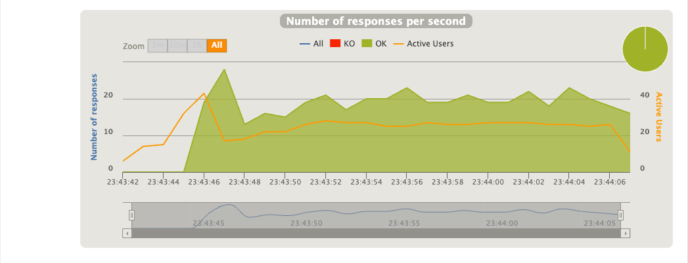

# 📈 Gatling Load Tests for Order Processing API

Este módulo contiene pruebas de carga para la API `/processOrder`, desarrolladas con **Gatling + Java DSL**.

---

## 🚀 Objetivo

Simular múltiples pedidos concurrentes para evaluar:

- Concurrencia sin errores ni pérdidas
- Tiempo de respuesta promedio
- Escalabilidad bajo distintas cargas

---

## 📁 Estructura del Proyecto


---

## ⚙️ Configuración por propiedades

La prueba usa un archivo `gatling.properties` para definir los parámetros de la carga. Podés personalizarlo sin tocar el código Java.

### 📝 Propiedades disponibles:

| Propiedad              | Descripción                                       | Valor por defecto |
|------------------------|---------------------------------------------------|-------------------|
| `baseUrl`              | URL base del servicio a testear                   | `http://localhost:8080` |
| `rampUsersPerSec`      | Cantidad de usuarios por segundo en ramp-up      | `100`             |
| `targetUsersPerSec`    | Carga final sostenida en usuarios/segundo        | `1000`            |
| `rampDurationSec`      | Tiempo en segundos del ramp-up                   | `60`              |
| `steadyDurationSec`    | Tiempo en segundos a carga sostenida             | `120`             |
| `assertionMeanMs`      | Tiempo máximo de respuesta promedio permitido    | `1000`            |
| `assertionSuccessRate` | Porcentaje mínimo de requests exitosas esperadas | `95.0`            |

---

## ⚡️ Perfiles sugeridos

### ✅ `gatling-ligth.properties` (liviano para desarrollo)

```properties
baseUrl=http://localhost:8080
rampUsersPerSec=5
targetUsersPerSec=20
rampDurationSec=10
steadyDurationSec=15
assertionMeanMs=1000
assertionSuccessRate=90.0
```
### ✅ `gatling-heavy.properties` (para test de estrés)

```properties
baseUrl=http://localhost:8080
rampUsersPerSec=5
targetUsersPerSec=20
rampDurationSec=10
steadyDurationSec=15
assertionMeanMs=1000
assertionSuccessRate=90.0
```
Podés duplicar el archivo gatling.properties y renombrarlo por perfil.


## ⚡▶️ Cómo ejecutar la prueba

1. Desde Maven
   
```bash
   mvn clean gatling:test -Dgatling.profile=light
```

```bash
   mvn clean gatling:test -Dgatling.profile=heavy
```
   Asegurate de que tu servicio esté corriendo en la URL configurada (baseUrl).
   

2. Desde las configuraciones de Intellij



## 📊 Resultados

Al finalizar, Gatling generará un informe HTML con métricas de la simulación:

```
target/gatling/<nombre-de-simulacion-fecha>/index.html
```
Abrilo en tu navegador para ver:

- Gráficos de tiempos de respuesta
- Cantidad de solicitudes
- Errores encontrados (503, timeouts, etc.)
- Distribución de percentiles





## 🧪 Recomendaciones
- Usá el perfil liviano para desarrollo y debugging.
- Usá el perfil pesado para validar concurrencia real como lo requiere el challenge.
- Documentá cualquier cuello de botella o resultado inesperado.

📬 Contacto
Desarrollado por [Ignacio J. Maylin] – Java Backend Challenge 2025.


